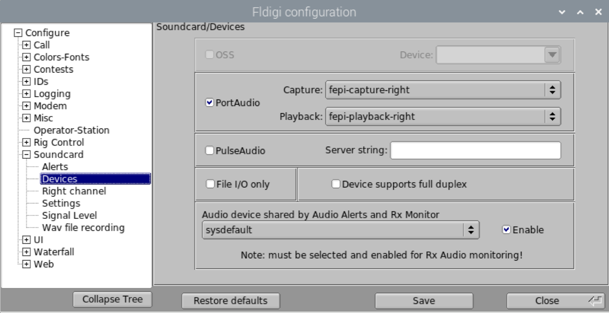

# Nexus DR-X Audio Configuration
Version: 20230402.0  
Author: Steve Magnuson, AG7GN  

## 1 Introduction

As of March, 2023 with the release of the 6.1.19 kernel in `raspberrypi-kernel 1:1.20230317-1`, the Nexus DR-X no longer uses PulseAudio with the Fe-Pi sound hat. The Raspberry Pi OS still uses PulseAudio, however, but the Fe-Pi has been excluded from PulseAudio. 

## 2 PulseAudio Modifications to Exclude Fe-Pi

Three modifications are needed for PulseAudio to exclude the Fe-Pi sound hat from PulseAudio operations

### 2.1 Tell PulseAudio to ignore the Fe-Pi when it's autodetecting audio interfaces

This is accomplished by adding a `/etc/udev/rules.d/89-pulseaudio-fepi.rules` file. This file has one line:

	ATTRS{id}=="Audio", ENV{PULSE_IGNORE}="1"

The `ATTRS{id}` looks for the string __Audio__. This ID is how the cards identify themselves to [ALSA](https://alsa-project.org/wiki/Main_Page). The Fe-Pi's ID is simply __Audio__.  When a match is made, it sets an environment variable `PULSE_IGNORE` to 1 ('true'). This tells PulseAudio to ignore cards that identify themselves as ALSA ID __Audio__ during PulseAudio's autodetect process.

The `89` at the beginning of the file name is used to determine the order in which the rules are executed. Files are examined in numerical order. PulseAudio's default rules are stored in `/usr/lib/udev/rules.d/90-pulseaudio.rules` and `/usr/lib/udev/rules.d/91-pulseaudio-rpi.rules`. Note that rules installed as part of the application are stored in `/usr/lib/udev/rules.d/`. User rules are stored in `/etc/udev/rules.d/`.  Since our file starts with `89`, it is executed before regular PulseAudio rules, ensuring that PulseAudio will ignore the Fe-Pi.


### 3 Create ALSA interfaces for Fe-Pi's stereo left and right channels

In order to enable different applications to use the Fe-Pi's left and right channels independently, it is necessary to create separate interfaces for each channel.
These interfaces are defined in `/etc/asound.conf` (shown below).  This configuration files tells ALSA to create capture and playback interfaces for the left and right channels. These interfaces can then be used as Port Audio devices in applications like Direwolf and Fldigi.

#### Notes and Observations

- The FePi is capable of a maximum sample rate of 96000. By default, it uses 48000. By leaving it undefined in the `pcm_slave.fepi` section in `/etc/asound.conf`, the rate can be set by the application using the FePi (like Direwolf or Fldigi). HOWEVER, it seems that decoding is hampered if this is NOT set, so leave it at 96000.
- The `period_size` and `buffer_size` settings are needed to prevent underruns when 96000 is used. Setting `periods` and `period_time` to 0 prevent audio stuttering.
- When using `dshare` to split the left and right playback channels, Direwolf would fail to start at every other attempt. Using `dmix` instead of `dshare` solved that problem.
- It's not a good idea to use the `dmix`, `dsnoop`, and `asym` interfaces directly. Instead, use the `plug` devices that reference those interfaces defined below so that the applications can set the `rate` and possibly other attributes.
- [Good ALSA reference](https://www.alsa-project.org/alsa-doc/alsa-lib/pcm_plugins.html).

#### Contents of `asound.conf`
```
pcm_slave.fepi {
	pcm {
		type hw
		card Audio
	}
	channels 2
   # Set sample rate 48000 (recommended) even though
   # FePi can do 96000
   rate 48000
   #periods 0
   period_time 0
   period_size 1024
   #period_size 2048
   buffer_size 8192
}

# dmix left and right must have the same
# ipc_key and it must be different from the
# dsnoop ipc_key. Likewise, dsnoop left and
# right must have the same ipc_key and it must 
# be different from the dmix ipc_key.
#
# When dshare is used instead of dmix, Direwolf
# fails to start every other time, generating this
# message:
# ALSA lib pcm_dshare.c:852:(snd_pcm_dshare_open) destination channel specified in bindings is already used
# Using dmix instead of dshare solves this problem.

pcm.fepi-dmix-left {
   type dmix
   ipc_key 202210090
   slave fepi
   bindings.0 0
}

pcm.fepi-playback-left {
   type plug
   slave.pcm "fepi-dmix-left"
   hint.description "Fe-Pi left channel TX audio plug"
}

pcm.fepi-dmix-right {
   type dmix
   ipc_key 202210090
   slave fepi
   bindings.0 1
}

pcm.fepi-playback-right {
   type plug
   slave.pcm "fepi-dmix-right"
   hint.description "Fe-Pi right channel TX audio plug"
}

pcm.fepi-dsnoop-left {
   type dsnoop
   ipc_key 202210091
   slave fepi
   bindings.0 0
}

pcm.fepi-capture-left {
   type plug
   slave.pcm "fepi-dsnoop-left"
   hint.description "Fe-Pi left channel RX audio plug"
}

pcm.fepi-dsnoop-right {
   type dsnoop
   ipc_key 202210091
   slave fepi
   bindings.0 1
}

pcm.fepi-capture-right {
   type plug
   slave.pcm "fepi-dsnoop-right"
   hint.description "Fe-Pi right channel RX audio plug"
}

pcm.fepi-asym-left {
   type asym
   playback.pcm "fepi-dmix-left"
   capture.pcm "fepi-dsnoop-left"
}

pcm.fepi-left {
   type plug
   slave.pcm "fepi-asym-left"
   hint.description "Fe-Pi left channel TX and RX plug"
}

pcm.fepi-asym-right {
   type asym
   playback.pcm "fepi-dmix-right"
   capture.pcm "fepi-dsnoop-right"
}

pcm.fepi-right {
   type plug
   slave.pcm "fepi-asym-right"
   hint.description "Fe-Pi right channel TX and RX plug"
}
```

## 4 Adjust Audio Settings  

### 4.1 Start `alsamixer`
Open a terminal and run:

	alsamixer

Press __F1__ for help familiarizing yourself with navigating the `alsamixer` interface.  
Some controls are in stereo.  The up and down arrows change the levels of both left (for the left radio) and right (for the right radio) channels. The left and right arrows selects the control.
      
- Pressing __Q__ or __E__ increases the left or right channel (radio) level respectively. 
	
- Pressing __Z__ or __C__ decreases the left or right channel (radio) level respectively.

- Press __F6__ and select __Fe-Pi Audio__ from the list. 

- Press __F5__ to see all audio controls.  

- Pay attention to the __Capture Attenuate Switch__ control (the control to the right of __L R CAPTURE__ as shown in the screenshot below). I find that my radios produce audio that is too 'hot' and so I have to enable this switch to add 6db of attenuation to the incoming levels. To enable the attenuation, set this control to __00__ and to disable it set it to __MM__.

	The blue box in the screenshot below shows the controls for output (to the radio) audio levels and the orange box shows the controls for input (from the radio) audio levels. For the Fe-Pi, these levels are good starting points. I found that leaving the __Lineout__ control at 100 and adjusting __PCM__ levels as needed worked best.

	

	Leave the remaining settings as-is. Note that I've shown the left and right __PCM__ channels and the __L R CAPTURE__ settings at different levels. This is to show that you can independently change the left and right channel levels. Different radios produce and require different audio levels, so some experimentation is needed to get the levels right. 
	
	You will want to open `alsamixer` while running Fldigi and/or direwolf and adjust
these settings on __Fe-Pi Audio__ as needed: 

	- __L R Capture__ and maybe the __Capture Attenuate Switch__ (for audio coming from the radio into the Pi - radio RX)  
	- __PCM__ (for audio coming from the Pi to the radio - radio TX)

	W6AF has published a [guide to setting FM audio levels](https://w6af.com/local-radio-activity/digital-modes/setting-up-sound-levels-for-fm-digital-operation/) using Fldigi that seems to work well for FM.
	IMPORTANT: W6AF's instructions assume that you have the Fldigi waterfall settings set to default values, which are:
	- Upper signal level (db): 0 
	- Signal range (db): 60
	- Tx level attenuator (db): -3
	
	These 3 settings are at the bottom of the Fldigi window.	Once you're happy with your audio settings, press __Esc__ to exit alsamixer.  

### 4.2 Save Audio Settings (not required)

These audio settings should save automatically, but for good measure you can store them again by running:

		sudo alsactl store

If you want to save different audio level settings for different scenarios, 
you can run this command to save the settings (__choose your own file name/location__)...

		sudo alsactl --file $HOME/mysoundsettings1.state store

...and this command to restore those settings:

		sudo alsactl --file $HOME/mysoundsettings1.state restore
		
If you want to restore the settings when the desktop launches, add the following line __BEFORE__  the `@xscreensaver` line in `/etc/xdg/lxsession/LXDE-pi/autostart`:

		@sudo alsactl --file $HOME/mysoundsettings1.state restore

### 4.3 Adjusting the Volume of the Built-In Sound Cards

The Pi's built-in sound interface can output audio to the audio jack on the board.  This is the __Analog__ output.  It can also send audio to HDMI-attached monitors that have built-in speakers.  This is the __HDMI__ output.  

- To toggle between __Analog__ and __HDMI__ outputs, right-click on the speaker icon on the menu bar in the upper right corner, then click __Audio Outputs__. Select __AV Jack__ for audio out of the headphone jack built in to your Pi or __HDMI__ for audio sent to your audio-equipped monitor. 

To adjust the level of the audio on your Pi's speakers, use the speaker's volume knob if it has one.  The speaker icon in the upper right of the Pi desktop also controls the Pi's speaker volume. Left-click on it to see the volume control. 

Another way is to adjust the volume in alsamixer (__vc4-hdmi__ and __1 bcm2835 Headphones__ devices).  

## 5 (Optional) Using Fldigi 4.1.09 (and later) Alerts, Notifications and RX Monitoring

Fldigi version 4.1.09 introduced the ability to control where alerts, notifications and monitoring audio is sent.  Obviously, you don't want to send that audio to the radio so having the ability to control where it goes is important.

### 5.1 Fldigi Alerts

Note that Fldigi [Alerts](http://www.w1hkj.com/FldigiHelp/audio_alerts_page.html) won't work for FSQ because it only looks in the signal browser for any text you specify in the alert.

The sound interface used for Alerts and RX Monitoring is set in __Configure > Config Dialog > Soundcard > Devices__.  

1.	In the __Audio device shared by Audio Alerts and Rx Monitor__ section, select `sysdefault` and check `Enable Audio Alerts`.  Click __Save__ and __Close__.

	


1.	In the left pane of the __Fldigi configuration__ window, select __Soundcard > Alerts__ to set up your alerts.  

	

Alerts will now play through the Pi's default sound interface. Remember that to toggle the output between the __AV Jack__ and __HDMI__, right-click on the speaker icon in the task bar on the top of the desktop, then click __Audio Outputs__.

### 5.2 Fldigi Notifications

Unlike Alerts, Fldigi [Notifications](http://www.w1hkj.com/FldigiHelp/notifier_page.html) can look for text in Fldigi's Receive Messages pane.  To set up an audio alert in Fldigi, open __Configure > Notifications__ 

1.	Enter your search criteria.
2.	Under __Run Program__, enter the following:

		aplay <path-to-WAV-file>
	For example:

		aplay $HOME/myalert.wav

This will send audio triggered by a Notification to the built-in audio interface.  Don't forget to select __Analog__ or __HDMI__ output as described earlier.

You can also use `paplay`, the PulseAudio player, which can play OGG audio files in addition to WAV files.  Example:

		paplay $HOME/fsq_ag7gn.ogg
		
Use this command list the audio formats `paplay` supports:

		paplay --list-file-formats

Both `aplay` and `paplay` are installed by default in RaspbianOS.

### 5.3 Fldigi RX Monitoring

Fldigi has built-in audio monitoring capability.  You can toggle RX monitoring on and off and apply filtering to the received audio by going __View > Rx Audio Dialog__.  The audio will be played through the built-in audio interface.  Don't forget to select __AV Jack__ or __HDMI__ output as described earlier. Note that you must have Audio Alerts configured and enabled in Fldigi for this to work (__Configure > Config Dialog > Soundcard > Devices__).

